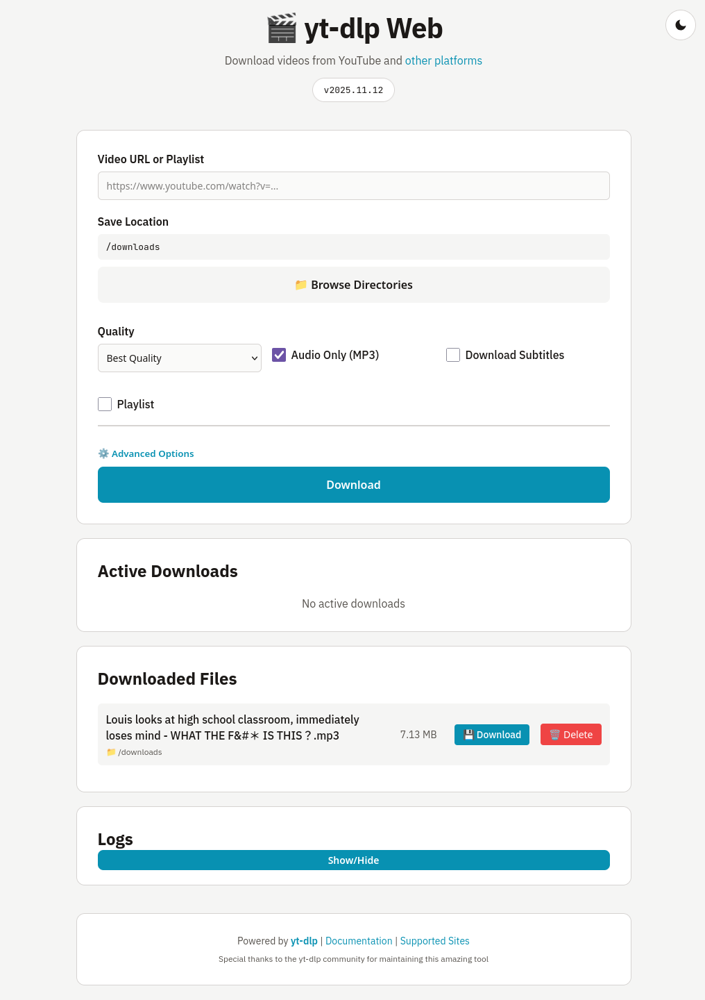
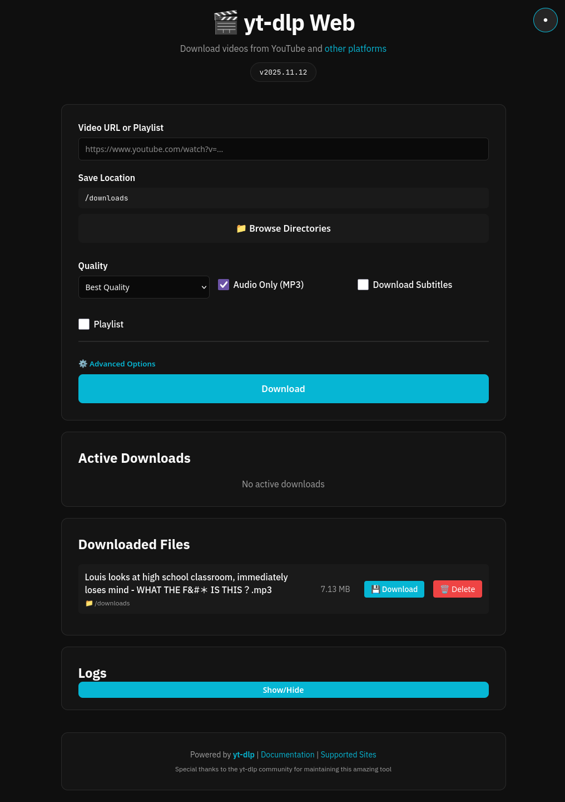

# yt-dlp Web Downloader

A self-hosted web interface for [yt-dlp](https://github.com/yt-dlp/yt-dlp) — the powerful command-line video downloader.

If you love yt-dlp but want a simple, browser-based way to use it from any device on your network, this project is for you. It wraps the inimitable yt-dlp in a clean web UI, letting you download videos from YouTube and 1000+ other sites without touching the command line.




## Features

- 🎬 Clean, modern web interface
- 📺 Support for YouTube videos and playlists
- 🌐 Works with 1000+ sites supported by yt-dlp
- ⚙️ Configurable download options (quality, format, audio-only)
- 📝 Subtitle download support
- 📊 Real-time download progress tracking
- 🗂️ File management with direct downloads
- 🔧 Advanced options with custom yt-dlp flags
- 🐳 Fully containerized with Docker

## Quick Start

### 1. Clone the repository

```bash
git clone https://github.com/SONDLecT/yt-dlp-dash.git
cd yt-dlp-dash
```

### 2. Configure docker-compose

Copy the example file and customize it:

```bash
cp docker-compose.example.yml docker-compose.yml
```

Edit `docker-compose.yml` to set:
- **Port**: Change `5000:5000` if you want a different port (e.g., `8080:5000`)
- **User**: Update `user: "1000:1000"` to match your user/group IDs (`id -u` and `id -g`)
- **Volumes**: Add any additional directories you want accessible for downloads

### 3. Build and run

```bash
docker compose up --build -d
```

### 4. Access the web interface

Open `http://localhost:5000` (or your configured port) in your browser.

### Updating

To update to the latest version:

```bash
git pull
docker compose up --build -d
```

## Usage

### Basic Download

1. Paste a YouTube URL (video or playlist) into the input field
2. Select quality/format options
3. Click "Download"

### Audio Only

Check the "Audio Only (MP3)" option to extract audio and convert to MP3.

### Playlist Downloads

- Paste a playlist URL
- Optionally set start/end indices in Advanced Options
- All videos will be downloaded sequentially

### Advanced Options

Click "⚙️ Advanced Options" to access:

- **Output Template**: Customize filename format using yt-dlp template syntax
  - Example: `%(uploader)s - %(title)s.%(ext)s`
- **Playlist Range**: Download specific videos from a playlist
- **Custom Flags**: Add any yt-dlp option as JSON
  - Example: `{"writeinfojson": true, "writethumbnail": true}`

### Supported Sites

yt-dlp supports 1000+ sites including:
- YouTube (videos, playlists, channels)
- Vimeo
- Twitter/X
- TikTok
- Twitch
- Reddit
- And many more...

See the [full list](https://github.com/yt-dlp/yt-dlp/blob/master/supportedsites.md).

## Configuration

### Environment Variables

- `DOWNLOAD_DIR`: Directory where files are saved (default: `/downloads`)

### Custom yt-dlp Options

Use the "Custom Flags" JSON field to pass any yt-dlp option:

```json
{
  "writeinfojson": true,
  "writethumbnail": true,
  "embedthumbnail": true,
  "embedsubtitles": true,
  "format": "bestvideo[height<=1080]+bestaudio/best"
}
```

## File Management

Downloaded files appear in the "Downloaded Files" section:
- View file name and size
- Click "Download" to retrieve files from the server
- Files are stored in the mounted volume

## Technical Details

- **Backend**: Python Flask
- **Downloader**: yt-dlp (latest version)
- **Media Processing**: ffmpeg
- **Container**: Python 3.11 slim base image

## Updating

To update yt-dlp to the latest version:

```bash
docker-compose down
docker-compose build --no-cache
docker-compose up -d
```

## Troubleshooting

### Downloads fail with "format not available"
- Try selecting "Best Quality" or a different quality preset
- Some videos may not have all quality options available

### Audio extraction fails
- Ensure ffmpeg is installed in the container (it should be by default)
- Check container logs: `docker logs ytdlp-web`

### Can't access the web interface
- Ensure the port isn't already in use
- Check firewall settings
- Verify container is running: `docker ps`

## Security Notes

- This app is meant for self-hosting on a private network
- Do not expose directly to the internet without additional security measures
- Consider adding authentication if deploying publicly
- Respect copyright laws and terms of service for downloaded content

## License

This project uses yt-dlp which is Unlicense licensed. Check individual dependencies for their licenses.

## Credits

Built with:
- [yt-dlp](https://github.com/yt-dlp/yt-dlp) - Video downloader
- [Flask](https://flask.palletsprojects.com/) - Web framework
- [ffmpeg](https://ffmpeg.org/) - Media processing
